# Tutorial for connecting the Keithley Spectrometer to Ubuntu 20.04 over LAN (Wired).

The Spectrometer **Keithley 2461** and **Ubuntu 20.04** operating systems are used in this tutorial, but it may also be applicable to other Keithley Spectrometer machines from the 24XX family which have LAN connection capabilities. We only need common Ubuntu commands because the Spectrometer does not require for LAN connection additional drivers to function properly with the Ubuntu OS.  

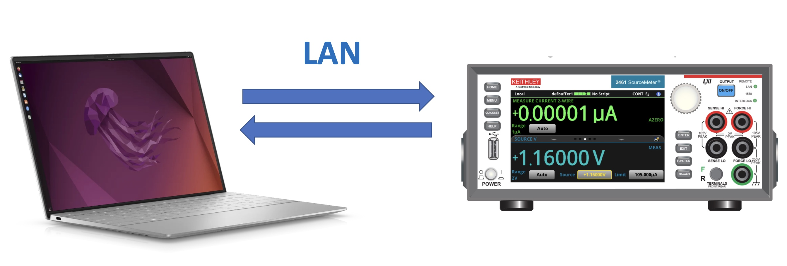

You can communicate with the Spectrometer using a local area network (LAN). The LAN interface can be used to build flexible test systems that include web access. This section provides an overview of LAN communications for the Model 2461.

The installation will place in 3 steps:  
- Physical layer connection
- Hardware layer connection
- Communication Protocol (TCP/IC) layer connection

# Step 1: Cable connection
This section describes how to set up the LAN communications on your computer. The Keithley 2461 LAN port is located at the back of the device, connect the one end. Connect the other end of the LAN cable to the Computer. If you use an adapter for the computer connection, like a LAN-to-USB adapter, this will not affect communication. 

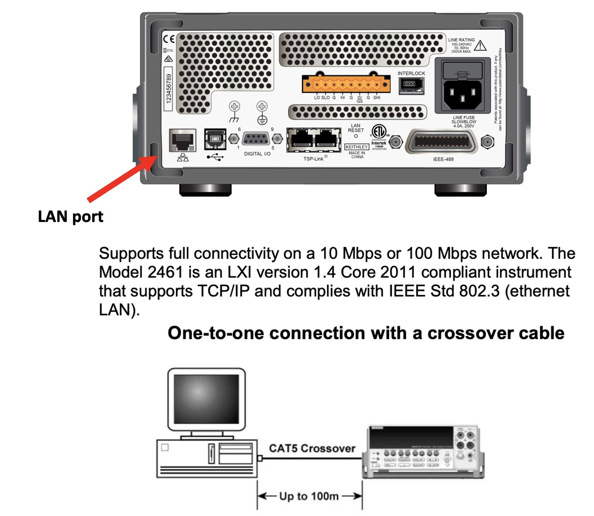

# Step 2: LAN status LEDs
The figure below illustrates the two status light emitting diodes (LED) that are on the LAN port of the instrument. The table below the figure provides explanations of the LED states. Wait for the LAN status indicator on the front panel to turn solid green. A solid green LAN status indicator confirms that the instrument was assigned an IP address. Note that it may take several minutes for the computer and instrument to establish a connection.

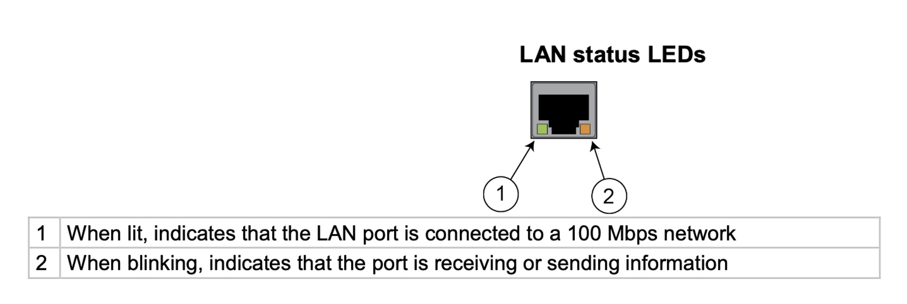

# Step 3: Wired connection
Ones you completed the physical connection, it’s time to proceed with the software connection. First, the system will try to connect wired connection. By clicking the tab on the top right it states "**Wired Connecting**". 

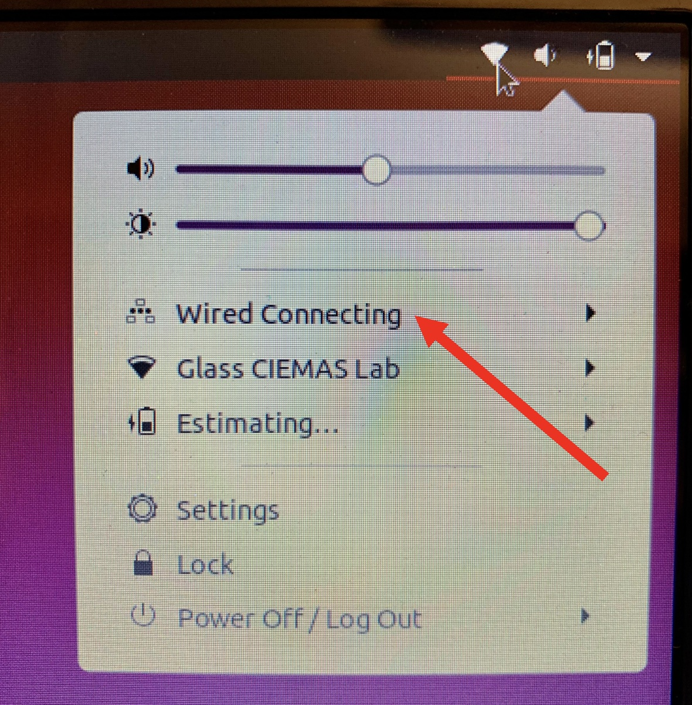

After waiting around 2 minutes a pop-up window appears which states "**Connection Failed**”.

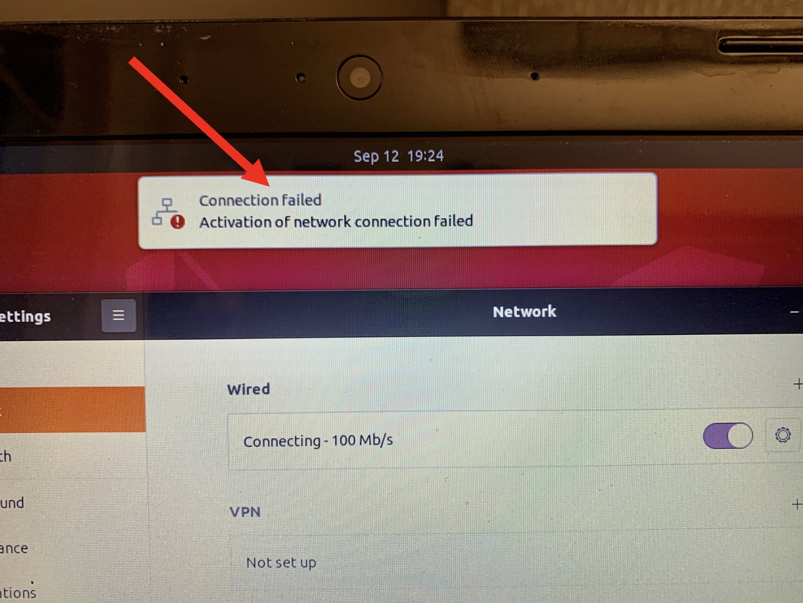

In order to solve this Error we need to clear and restart the Network drivers by executing the following 2 commands:

```
	sudo service network-manager restart
	sudo systemctl restart NetworkManager.service
```  

Wait for 2-3 minutes and the status from "**Wired Connecting**" will change to "**Wired Connected**".

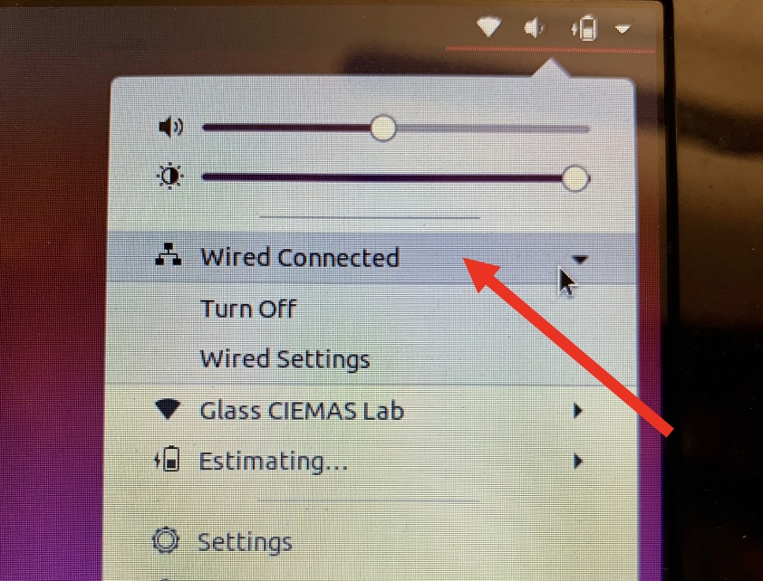


# Step 4: install ipconfig and one IPV4
However, even if the connection is established the communication is not complete. In order for those devices to communicate we need to establish an IP/TCP protocol communication. In particular by installing the following package:
```
sudo apt install net-tools
```
And my executing the following command:
```
ifconfig
```
In the figure below see the WI-FI connection (named wlp2s0), which works properly, and has an IPv4 address: “inet 192.169.1.3 netmask 255.255.255.0 broadcast 192.168.1.255”. While in the Wired connection (named en1s0), which is the connection we are trying to complete for the communication with the Keithley 2461 device, there is not such a line (the line which defines the IPV4 is missing). Moreover, my PING from the computer's Terminal to the device with the provided IP of the device we do not get any package back.

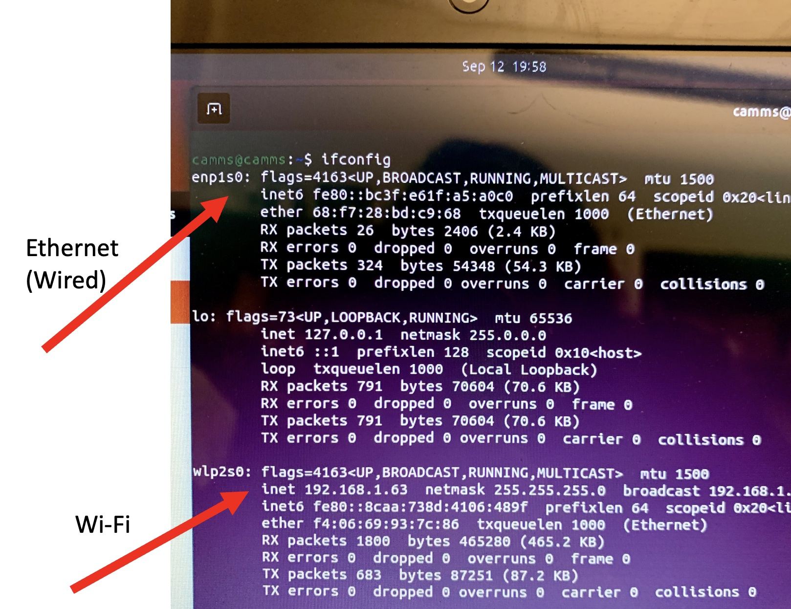


# Step 5: Static IP addresses  
In order to solve this problem on Keithley 2461 device and on the Computer, we need to establish a Static IP address. For the Keithley 2461 device, go to Menu > Communications > LAN, in this tab by clicking the AUTO button to change the TCP/IP Mode select Manual and insert in the IP Address section **128.181.240.130**, in the Subset section insert **255.255.248.0** and then press Apply Settings.

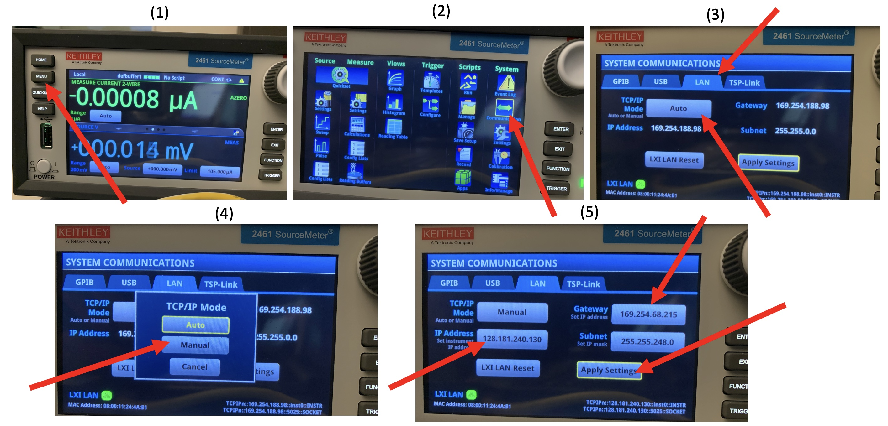

Ones you completed the Manual IP Address setting in the device, we need to complete a similar setup on the Computer. First, select the top right tab and by clicking the sub-tab Wired Connected, select Wired Setting. Then Click the Gear, and then from the IPv4 tab click. In this Tab select "Manual" and insert the IP Address section **128.181.240.131** and as Mask **255.255.248.0**, leave auto DNS.

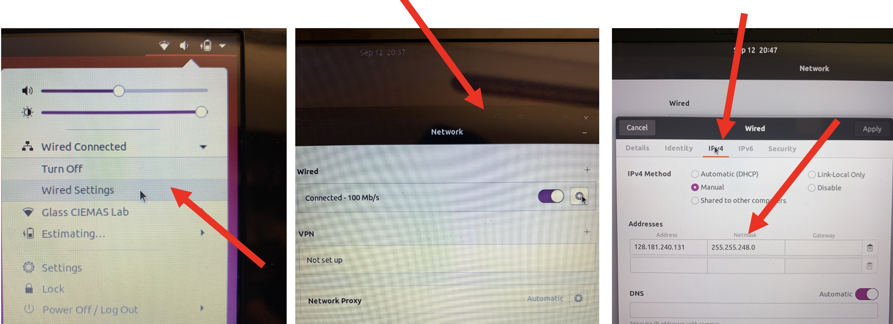

# Step 5: Verify Connection
Now that the IP/TCP protocol is ready, we may check the connection. Initially, by checking the connection status we see that there is an IPv4 line with Mask which previously didn't exist. And if we ping the **128.181.240.131** we receive packages back.

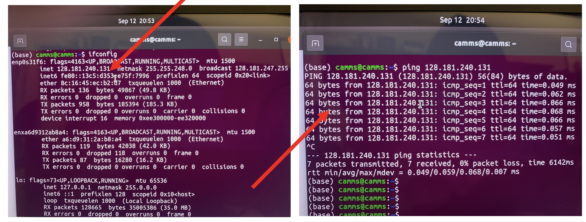


# Step 6: Install LXI Discovery Browser software on your computer
You can use the LXI Discovery Browser to identify the IP addresses of LXI-certified instruments. Once identified, you can double-click the IP address in the LXI Discovery Browser to open the web interface for the instrument. By executing the following command you install the LXI program and you may check the connection.
```
sudo apt-get install lxi-tools
```

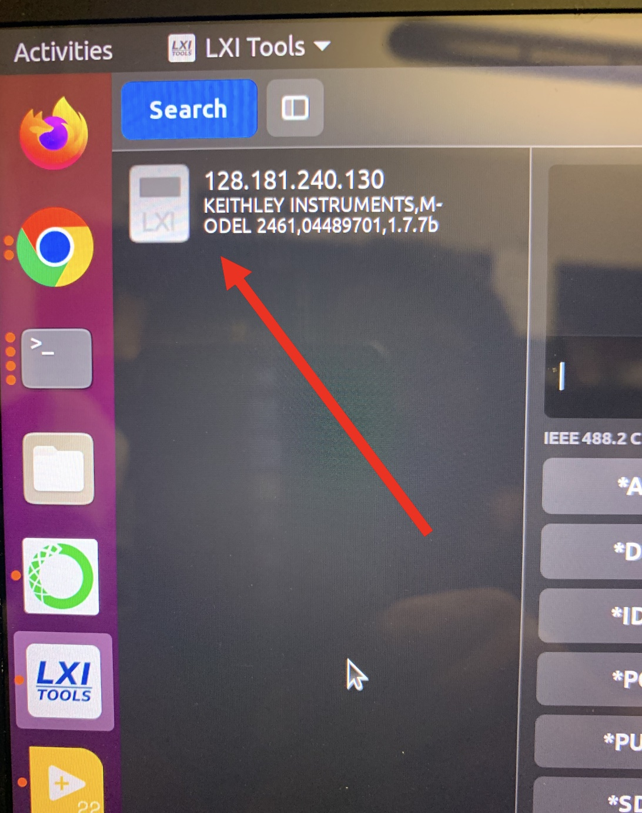


# Step 7: NI & Python
In a different tutorial, we will demonstrate how to install NI and Python interactions with the Keithley 2461 device through a LAN connection, because it needs drivers and depends on those drives. The scope of this tutorial is to communication with a spectrometer device without the use of external drivers.

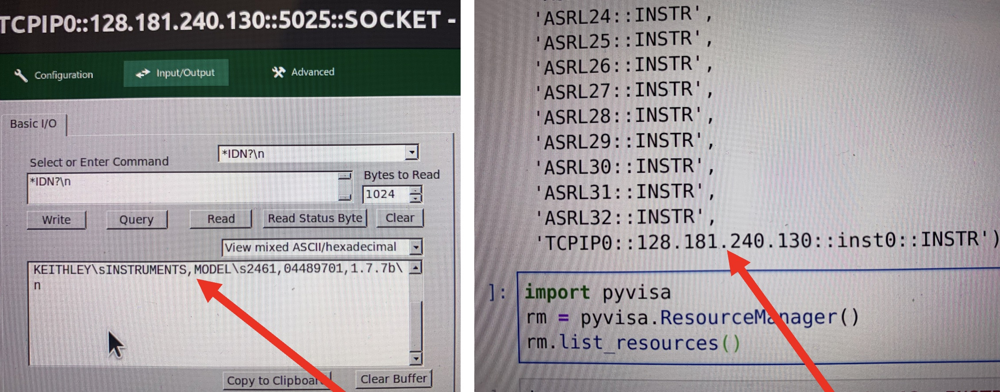

# Extra: One-to-many connection

With a LAN hub, a single network interface card can be connected to as many instruments as the hub can support. This requires straight-through network (not crossover) cables for hub connections. The advantage of this method is easy expansion of measurement channels when the test requirements exceed the capacity of a single instrument. With only the instruments connected to the hub, this is an isolated instrumentation network. However, with a corporate network attached to the hub, the instruments become part of the larger network.

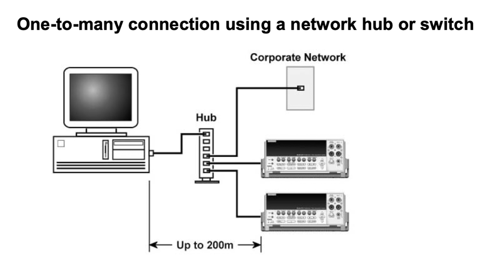

# Refs & Links
Image Ubuntu: https://res.cloudinary.com/canonical/image/fetch/f_auto,q_auto,fl_sanitize,w_1088,h_630/https://assets.ubuntu.com/v1/a8e96807-desktop-xps13-small.png  
Article: https://itsfoss.com/restart-network-ubuntu/  
Article: https://vitux.com/find-devices-connected-to-your-network-with-nmap/  
Article: https://www.tek.com/en/support/faqs/it-possible-establish-peer-peer-ethernet-connection-5-and-6-series-mso  
Article: https://superuser.com/questions/1037346/i-have-both-ipv4-and-ipv6-public-addresses-why  